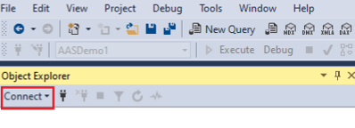
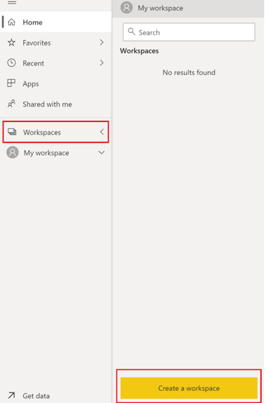

##  Introduction

In this article, we will explore how to implement incremental refresh to a Power BI Premium tabular model.
</br>
</br>

### What is incremental refresh?
Incremental refresh enables very large datasets in the Power BI Premium service with the following benefits:

* Refreshes are faster - Only data that has changed needs to be refreshed. For example, refresh only the last five days of a ten-year dataset.

* Refreshes are more reliable - It's no longer necessary to maintain long-running connections to volatile source systems.

* Resource consumption is reduced - Less data to refresh reduces overall consumption of memory and other resources.

Essentially, setting up the incremental refresh in Power BI means loading only part of the data on a regular basis, and storing the consistent data. This process will make your refresh time much faster!

**Note:** A limitation of incremental refresh in Power BI is that after setup, you cannot download the PBIX file from the service anymore, because the data is now partitioned.
</br>
</br>

### What technologies are used?
* **Azure SQL Data Warehouse** (To store structured data)

    * A data warehouse is designed to take data from multiple systems, prepare the data for a specific reporting purpose and house and structure the data, ready for querying
    
    * Designed for business intelligence and analytics
    
    * Data is first prepared and then stored in relation tables. This reduces storage costs, and improves query performance
    
    **Note:** Azure SQL Data Warehouse will soon be replaced by [Azure Synapse](https://docs.microsoft.com/en-us/azure/sql-data-warehouse/sql-data-warehouse-overview-what-is)
</br>

* **Azure Blob Storage** (To store raw data files)
    * Azure Blob storage is Microsoft's object storage solution for the cloud.
    
    * Blob storage is optimized for storing massive amounts of unstructured data.
    
    * Blob storage offers three types of resources:
    </br>
</br>
 
* **Azure Data Factory** (To ingest data from raw file to Azure SQL Data Warehouse)

    * A hybrid data integration service which makes connecting and moving data easy
    
    * Used for loading data in to Azure Data Lake or SQL Data Warehouse
    
    * Can schedule data copies from on-premises to the cloud
</br>

* **SQL Server Management Studio** (To connect to Azure SQL Data Warehouse and Azure Analysis Services)

    * Integrated environment for managing any SQL infrastructure, from SQL Server to Azure SQL Database
    
    * Provides tools to configure, monitor, and administer instances of SQL Server and databases
    
    * Use SSMS to query, design, and manage your databases and data warehouses
</br>

* **Power BI Desktop** (To create tabular model, implement incremental refresh and publish to Power BI Premium)

	* A business analytics solution that lets you visualize your data and share insights across your organization, or embed them in your app or website.
</br>

* **Power BI Premium** (To store tabular models with incremental refresh in Power BI Service)

	* Provides dedicated and enhanced resources to run the Power BI service for your organization
	
	* With Power BI Premium, you get dedicated capacities. In contrast to a shared capacity where workloads run on computational resources shared with other customers, a dedicated capacity is for exclusive use by an organization. It's isolated with dedicated computational resources, which provide dependable and consistent performance for hosted content.
</br>

##  Task 1: Download Sample Data


1.  Navigate to: [Sample Data](https://github.com/matthewrodin/PowerBIPremium-IncrementalRefresh/tree/master/Sample%20Data)

2.  Download “SampleCustomerData2.csv” and “SampleSalesData2.csv” to a local machine
</br>

##  Task 2: Create Azure SQL Data Warehouse

1.  Navigate to: [Azure Portal](https://portal.azure.com/)

2.  In the search bar, type “sql” and select “SQL data warehouses
</br>

3.  On the top left, click “+ Add”
</br>

    a.  Under “Subscription” -> Select existing Azure subscription 
    
    b.  Under “Resource group” -> Click “Create New” -> Enter a name for the resource group
    
    c.  Under “Data Warehouse name” -> Enter a name for the data warehouse
    
    d.  Under “Server” -> Click “Create New” 
    
        i.   Under “Server Name” -> Enter a unique name for the server
        
        ii.  Under “Server Admin Login” -> Create a username for the server
        
        iii. Under “Password” -> Create a password for the server

		iv.  Under “Location” -> Select “Canada Central”

		v.   Tick “Allow Azure services to access server”

		vi.  Click “OK”

	e. Under “Performance Level”, select “Select performance level”

		i.   Click “Gen2”

		ii.  Scale the data warehouse. For reference, the service levels range from DW100c to DW30000c. 

		iii. Click “Apply”
        
    f. On the bottom left, click the blue “Review + Create” button
    
    g.  On the bottom left, click the blue “Create” button
    
</br>
Deployment may take up to 20 minutes.
</br>
</br>

##  Task 3: Prepare SQL Data Warehouse for Data Ingestion
1. Open **Command Prompt** (Run as Administator)


2. Run the following command:
`sqlcmd -S <servername> -d <databasename> -U <serverusername> -P <serverpassword> -I`
**Note:** The ServerName can be found in the “Overview” window of the SQL Data Warehouse resource in the Azure portal.
3. If the following error is received: *“Sqlcmd: Error: Microsoft ODBC Driver 17 for SQL Server : Cannot open server…”*
    
	a.	Copy the IP address provided in the error message

	b.	Navigate to portal.azure.com

	c.	In the search bar, type “sql server” and select “SQL servers”
    </br>

	d.	Select the server created in Task 2

	e.	Select “Firewalls and virtual networks”
    </br>
    
        i.   Under “Allow Azure services and resources to access this server” -> Click “On”
        
        ii.  Under Rule Name -> “Rule1”
        
        iii. Under Start IP -> Paste the copied IP Address
        
        iv.  Under End IP -> Paste the copied IP Address
    </br>
    
    f.	Click “Save”

4.	“1>” should now appear.

5.	Run the following script:
    ```sql
    CREATE TABLE [dbo].[DimCustomer](
        [CustomerKey] [int] NOT NULL,
        [AddressLine1] [varchar](500) NULL,
        [CommuteDistance] [varchar](500) NULL,
        [EmailAddress] [varchar](500) NULL,
        [FirstName] [varchar](500) NULL,
        [LastName] [varchar](500) NULL,
        [Gender] [varchar](500) NULL,
        [Phone] [varchar](500) NULL,
        [YearlyIncome] [varchar](500) NULL,
        [MaritalStatus] [varchar](500) NULL,
        [GeographyKey] [int] NULL,
        [EnglishEducation] [varchar](500) NULL,
        [EnglishOccupation] [varchar](500) NULL,
        [TotalChildren] [int] NULL);
    GO

    ```

6.	Run the following script:
    
    ```sql
    CREATE TABLE [dbo].[FactSales](
        [CustomerKey] [int] NOT NULL,
        [ProductKey] [int] NOT NULL,
        [CurrencyKey] [int] NOT NULL,
        [SalesOrderNumber] [varchar](500) NOT NULL,
        [SalesTerritoryKey] [int] NOT NULL,
        [TaxAmt] [varchar](500) NOT NULL,
        [Freight] [varchar](500) NOT NULL,
        [SalesAmount] [varchar](500) NOT NULL,
        [Year] [int] NOT NULL,
        [Month] [int] NOT NULL,
        [Day] [int] NOT NULL)
    GO

    ```

</br>

##  Task 4: Create a Storage Account

1.	Navigate to [Azure Portal](https://portal.azure.com/)

2.	In the search bar, type “storage” and select “Storage accounts”
</br>

3.	Click “+ Add”
</br>

    a.	Under “Subscription” -> Select existing Azure subscription
    
    b.	Under “Resource group” Select the resource group created in Task 2
    
    c.	Under “Storage account name” -> Enter a name for the storage account
    
    d.	Under “Location” -> Select “Canada Central”
    
    e.	Under “Performance” -> Select “Standard”

    f.	Under “Account kind” -> Select “StorageV2 (general purpose v2)”

    g.	Under “Replication” -> Select “Locally-redundant storage (LRS)”
    
    h.	Under “Access tier (default)” -> Select “Cool”
    
    i.	On the bottom left, click the blue “Review + Create” button
    
    j.	On the bottom left, click the blue “Create” button
    
</br>Deployment may take a minute.
</br>
</br>

4.	Click “Go to Resource”

5.	Under “Blob service” -> Click “Containers”
</br>

6.	Click “+ Container”
</br>

    a.	Under “Name” -> Enter a name for the container
    
    b.	Under “Public access level” -> Select “Blob (anonymous read access for blobs only)”
    
7.	Select “Storage Explorer”
</br>

8.	Click on “BLOB CONTAINERS”
</br>

9.	Click on the container that was just created

10.	Click “Upload”
</br>

11.	Click the blue browse button and upload the local copies of “SampleCustomerData2.csv” and “SampleSalesData2.csv” to the container. 
</br>

12.	Leave “Overwrite if files already exist” blank

13.	Click "Upload"

</br>

##  Task 5: Create a Data Factory

1.	Navigate to [Azure Portal](https://portal.azure.com/)

2.	In the search bar, type “data factory” and select “SQL data warehouses”
</br>

3.	Click “+ Add”
</br>

    a.	Under “Name” -> Enter a name for the data factory
    
    b.	Under “Version” -> Select “V2”
    
    c.	Under Subscription” -> Select existing Azure subscription
    
    d.	Under “Resource Group” -> Select the resource group created in Task 2
    
    e.	Under “Location” -> Select “Canada Central”
    
    f.	Untick “Enable Git”
    
    g.	Click “Create”

</br>

##  Task 6: Create a Data Factory Pipeline

1.	Navigate to [Azure Data Factory](https://adf.azure.com/)

2.	Under “Azure Active Directory” -> Select existing Azure AD

3.	Under “Subscription” -> Select existing Azure subscription

4.	Under Data Factory name -> Select the Data Factory created in Task 5

5.	Click “Continue”

6.	Click the Home icon
</br>

7.	Click “Copy data”
</br>

8.	Under “Properties”

    a.	Under “Task Name” -> Enter a name for the task
    
    b.	Under “Task cadence or task schedule” -> Select “Run once now”
    
    c.	Click “Next”
    
9.	Under “Source”

    a.	Select “Azure”
    
    b.	Select “+ Create new connection”
    </br>
    
    c.	Select “Azure Blob Storage”
    
    d.	Click “Continue"
    </br>
    
    e.	Under “Name” -> Enter a name for the connection
    
        i.   Under “Account selection method” -> Select “From Azure Subscription”
        
        ii.  Under “Azure subscription” -> Select existing Azure subscription
        
        iii. Under “Storage account name” -> Select the storage account created in Task 4
        
        Note: Leave all other fields as the default
        
        v.   Click “Create”
        
    f.	Click “Next”
    
    g.	Under “File or folder” -> Click “Browse”
    
    h.	Double click the container created in Task 4
    
    i.	Select “SampleCustomerData2.csv”
    
    j.	Click “Choose”
    
    k.	Note: Keep all other fields as the default
    
    l.	Click “Next”
    
    m.	Verify the schema under “Preview” and click “Next”

10.	Under “Destination”

    a.	Click “Azure”

    b.	Click “Create new connection”
    
    c.	Select “Azure Synapse Analytics (formerly SQL DW)”

    d.	Click “Continue”
    </br>
    
    e.	Under “Name” -> Enter a name for the connection
    
        i.    Under “Account selection method” -> Select “From Azure Subscription”
        
        ii.   Under “Azure subscription” -> Select existing Azure subscription
        
        iii.  Under “Server name” -> Select the server created in Step 2
        
        iv.   Under “Database name” -> Select the storage account created in Step 4
        
        v.    Under “Authentication type” -> Select “SQL authentication”
        
        vi.   Under “User name” -> Enter the username of the server created in Task 2
        
        vii.  Under “Password -> Enter the username of the server created in Task 2
        
        Note: Leave all other fields as the default
        
        ix.   Click “Create”
        
    f.	Click “Next”
    
    g.	In the dropdown, select “dbo.DimCustomer”
    </br>
    
    h.	Click “Next”
    
    i.	Alter the source types in order to match the destination. The column mapping should look like this:
    </br>
    
    j.	Click “Next”
    
11.	Under “Settings”

    a.	Under “Staging account linked service” -> Select the connection created in Task 6 (Step 9e)
    
    b.	Click “Next”

12.	Under “Summary”, verify the summary appropriately summarizes the intended pipeline and click “Next”

13.	Under “Deployment”, verify that the deployment was successful and click “Finish”

</br>
Repeat Steps 1 to 13 of Task 6 for “SampleSalesData2.csv”.

* In Step 10g, select “dbo.FactSales”

* In Step 10i, the mapping should match the following:
</br>

</br>

##  Task 7: Verify Data Ingestion

1.	Open **Microsoft SQL Server Management Studio**

    For more information about SSMS or to download, visit: [SSMS](https://docs.microsoft.com/en-us/sql/ssms/download-sql-server-management-studio-ssms?view=sql-server-ver15)

2.	Click “Connect” -> “Database Engine…”
</br>

    a.	Under “Server name” -> Enter the server name of server created in Task 2
    
    b.	Under “Authentication” -> Select “SQL Server Authentication”
    
    c.	Under “Login” -> Enter the username of the server created in Task 2
    
    d.	Under “Password” -> Enter the password of the server created in Task 2.
    
    e.	Click “Connect”

</br>
In the “Object Explorer” pane, under

*ServerName.database.windows.net -> "Databases" -> SQLDataWarehouseName -> "Tables"* </br>
the two tables created in Task 3 should appear.
</br>

3.	Right click one of the two tables and click “Select Top 100 Rows”. 
    Under “Results”, data should now be populated in the selected table from the CSV file.

4.	Repeat Step 8 for the other table

</br>

##  Task 8: Create Power BI Premium Workspace

1.	Navigate to [Power BI](https://www.powerbi.com)

2. 	On the top right, click sign in and enter credentials to access a Power BI Premium account 

3.	Click “Workspaces”
</br>

4.	Click “Create a workspace”

	a.	Under “Workspace name”, enter a name for the workspace

	b.	Click “Advanced”

	c.	Ensure that “Dedicated capacity” is turned On.
	</br>

	d.	Choose an available dedicated capacity for this new workspace

	e.	Click “Save”

A diamond should now appear next to the newly created workspace, indicating it is a premium workspace.
</br>

</br>

##  Task 9: Create Data Model

1.	Open **Power BI Desktop**. </br>
If Power BI Desktop is not currently installed, it can be using the following link: [PowerBI](https://powerbi.microsoft.com/en-us/downloads/)

2.	Click “Get data”
</br>

3.	Under “Azure” -> Click “Azure SQL Data Warehouse”

	a.	Click “Connect”
	</br>

4.	Under “Server” -> Enter the name of the SQL Data Warehouse server name created in Task 2.

5.	Ensure that “Import” is selected

6.	Click “Ok”

7.	Double-click the model name and tick both tables
</br>

8.	Click “Load”

**Note:** Large datasets with potentially billions of rows may not fit into a Power BI Desktop model because the PBIX file is limited by the memory resources available on the desktop computer. Such datasets are therefore commonly filtered upon import. This type of filtering applies whether using incremental refresh or not.
In the case of large datasets, in order to filter the tables upon import, click “Transform Data” in Step 7 (instead of “Load”)

On the right, the two tables should now be visible:
</br>

9.	Click the “Model” icon
</br>

	**Note:** Power BI should have predicted the intended model relationship as a 1-to-many between the two imported tables.
	If this is not the case, click and drag the “CustomerKey” column from the “DimCustomer” table onto the “CustomerKey” column of the “FactSales” table and release the mouse.
	</br>

10.	In order to create a report/dashboard with visualizations, return to the “report” view of Power BI.
</br>

11.	Save the Power BI file (.pbix)

</br>

##  Task 10: Implement Incremental Refresh

### Part 1: Enable Incremental Refresh

1.	Open the Power BI file created in Task 9 in Power BI Desktop

2.	Under “File”, click “Options and settings” and then click “Options”
</br>

3.	Under “Preview features”, ensure that “Incremental Refresh Policies” is ticked.
</br>

4.	Click “Ok”
</br>
### Part 2: Create Parameters

For incremental refresh, datasets are filtered by using Power Query date/time parameters with the reserved, case-sensitive names **RangeStart** and **RangeEnd**. These parameters are used to filter the data imported into Power BI Desktop, and also to dynamically partition the data into ranges once published to the Power BI service. __The parameter values are substituted by the service to filter for each partition. There's no need to set them in dataset settings in the service.__ Once published, the parameter values are overridden automatically by the Power BI service.

1.	Open the Power BI file created in Task 9 in Power BI Desktop

2.	Click “Edit Queries” to open Power Query Editor
</br>

3.	Click “Manage Parameters”
</br>

4.	Click “New”
</br>

	a.	Under “Name”, enter “RangeEnd”

	b.	Untick “Required”

	c.	Under “Type”, choose “Date/Time”

	d.	Under “Suggested Values”, choose “Any value”

	e.	Under “Current Value”, enter the 1st of the of the current month, in the following format: mm/dd/yyyy hh:mm:ss AM/PM

	f.	Click “Ok”
	</br>

5.	Repeat Step 4 for the “RangeStart” parameter and by changing the “Current Value” with the 1st of last month
</br>
</br>
### Part 3: Apply Filter

1.	While still inside the Power Query Editor from Task 10, Step 2, click the Open the Power BI file created in Task 9 in Power BI Desktop

2.	Click on the “FactSales” table
</br>

3.	Hold the Ctrl key on the keyboard and this the “Year”, “Month” and “Day” columns. Release the Ctrl key. 

4.	Under “Transform”, click “Merge Columns”
</br>

	a.	Under “Separator”, select “--Custom--”

	b.	In the empty text box, type “/” as the custom separator

	c.	Under “New column name (optional)”, enter “SalesDate”

5.	Select the newly merged “SalesDate” column

6.	Under “Transform”, under “Data Type”, select “Date/Time”
</br>

7.	Click the downwards arrow on the “SalesDate” column
</br>

8.	Under “Date/Time Filters”, select “Custom Filter…”
</br>

9.	Enter the following configuration
</br>

10.	Click “Ok”

11.	Click “Close & Apply”
</br>
</br>
### Part 4: Define Incremental Refresh Policy

1.	Open the Power BI file created in Task 9 in Power BI Desktop

2.	Right click the ellipses on the “FactSales” table and click “Incremental Refresh”
</br>

3.	Under “Table”, select “FactSales”

4.	Make sure “Incremental refresh” is turned on 

**Note:** It's important the partition filters are pushed to the source system when queries are submitted for refresh operations. To push filtering down means the datasource should support query folding. Most data sources that support SQL queries support query folding. However, data sources like flat files, blobs, web, and OData feeds typically do not. In cases where the filter is not supported by the datasource back-end, it cannot be pushed down. In such cases, the mashup engine compensates and applies the filter locally, which may require retrieving the full dataset from the data source. This can cause incremental refresh to be very slow, and the process can run out of resources either in the Power BI service or in the on-premises data gateway if used.
Given the various levels of query folding support for each datasource, it's recommended that verification is performed to ensure the filter logic is included in the source queries. To make this easier, Power BI Desktop attempts to perform this verification for you. If unable to verify, a warning is displayed in the incremental refresh dialog when defining the incremental refresh policy. SQL based data sources such as SQL, Oracle, and Teradata can rely on this warning. Other data sources may be unable to verify without tracing queries. If Power BI Desktop is unable to confirm, the following warning is displayed: </br>
</br>

5.	Complete the configuration as follows:
</br>

	The above example defines a refresh policy to store data for seven full calendar months plus data for the current month up to the current date, and incrementally refresh twenty days of data. The first refresh operation loads historical data. 

	Subsequent refreshes are incremental, and (if scheduled to run daily) perform the following operations:

	* Add a new day of data.

	* Refresh twenty days up to the current date.

	* Remove calendar months that are older than seven months prior to the current date. For example, if the current date is January 1st, 2020, any data before June 1st, 2019 is removed.

	The first refresh in the Power BI service may take longer to import all seven full calendar months. Subsequent refreshes may be finished in a fraction of the time.

6.	(Optional) Detect data changes
Incremental refresh of twenty days is more efficient than full refresh of seven months. However, it's possible to do even better. If you select the “Detect data changes” checkbox, you can select a date/time column used to identify and refresh only the days where the data has changed. This assumes such a column exists in the source system, which is typically for auditing purposes. **This should not be the same column used to partition the data with the RangeStart/RangeEnd parameters.** The maximum value of this column is evaluated for each of the periods in the incremental range. If it has not changed since the last refresh, there is no need to refresh the period. 

7.	(Optional) Only refresh complete days
For example, if one is refreshing data from a financial system where data for the previous month is approved on the 12th calendar day of the month. One could set the incremental range to 1 month and schedule the refresh to run on the 12th day of the month. With this option checked, it would for example refresh January data on February 12th.

</br>

##  Task 11: Deploy Model to Power BI Premium

1.	Open the Power BI file created in Task 9 in Power BI Desktop

2.	Click “Publish”
</br>

3.	Select the workplace created in Task 8

4.	Click “Select”

A “Success” notification should now be visible
</br>

5.	Click “Open xxxx.pbix in Power BI” to view the report in Power BI Service.

6.	If the following error is received
</br>

	a.	Under “Workspaces”, click on the workspace created in Task 8.

	b.	Navigate to “Datasets”
	</br>

	c.	Click on the ellipses
	</br>

	d.	Click “Settings”
	</br>

	e.	Click “Edit credentials”
	</br>

		i.   Under “Authentication method”, choose “Basic”

		ii.  Under “User Name”, enter the user “Server Admin Login” chosen for the server in Task 2

		iii. Under “Password", enter the user “Password” chosen for the server in Task 2

		iv.  Under “Privacy level setting for this data source”, choose “None”

		v.   Click “Sign in”

</br>

##  Resources

* [Power BI Premium](https://docs.microsoft.com/en-us/power-bi/service-premium-what-is)

* [Incremental Refresh with Power BI](https://docs.microsoft.com/en-us/power-bi/service-premium-incremental-refresh)

* [Christian Wade (Power BI Program Manager at Microsoft) Discusses Incremental Refresh](https://www.youtube.com/watch?v=CajQjq70Kpg)


